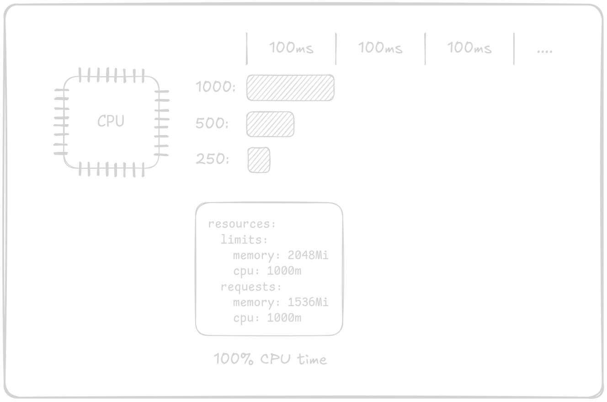

# Understanding CPU Units in Kubernetes

In Kubernetes, one of the key resource limits we deal with is **CPU**. But how exactly is CPU usage measured and managed in Kubernetes? You may have seen units like `m` (millicores) or `vCPU`, but what do they mean? Let’s break this down clearly.

## What Are CPU Units?

Kubernetes measures CPU resources in terms of **CPU cores**. For each container, you can specify both a **request** (how much CPU the container is expected to use under normal conditions) and a **limit** (the maximum amount of CPU the container is allowed to use).

```yaml
  resources:
    limits:
      cpu: "500m"
    requests:
      cpu: "100m"
```

### The Concept of "Microcores" (millicores)

Kubernetes uses **millicores** (represented by `m`) to manage fractional CPU units. This is extremely useful when dividing CPU resources across multiple containers. 

1 CPU core is equivalent to 1000 millicores (`1000m`).  
Thus, 1 millicore (`1m`) represents 1/1000th of a CPU core.

For example:
- If a container requests **500m**, it means the container is asking for 50% of a CPU core.
- If a container is limited to **1000m**, it means the container cannot use more than 1 full CPU core, regardless of how much load it experiences.

This system allows for fine-grained control over how CPU resources are distributed among containers.

## Right to Use CPU time

Now that we understand how CPU units can be divided, let's explore how Kubernetes allocates actual CPU time to containers.

At a high level, when a container has a CPU limit of 1000m, it means that the container has the right to use 100% of a CPU core’s time within Kubernetes' default time cycle, which is 100 milliseconds. In other words, for each 100ms, the container can use the CPU for the full duration of that period.

If the container has a CPU limit of 500m, it can use 50% of the CPU time, meaning it gets 50 milliseconds of CPU time out of the 100ms cycle.

Kubernetes uses this time-slicing mechanism to ensure fair distribution of CPU resources. Containers with lower CPU limits will be scheduled for shorter time slots within the cycle, while containers with higher limits get longer time slices.

{: .light }
{: .dark }

On the most common scenario where a cluster node has more than one container running, Kubernetes will let the containers use the CPU in a time-sliced manner. If a container is configured with a CPU limit of `500m`, it means it is entitled to use 50% of a CPU core. Kubernetes achieves this by interleaving the execution of multiple containers within the same CPU core.

For instance, when two containers each have a limit of `500m`, Kubernetes will alternate their execution on the same core. Each container will get approximately 50ms of CPU time within a 100ms period. This is done in a way that ensures fair usage of the CPU core based on the container’s assigned limits, effectively allowing both containers to share the CPU without one overstepping its allowed usage.

Similarly, if a container has a limit of `1000m`, it will consume the full 100ms on a single CPU core, while a container with a lower limit, like `100m`, will only be scheduled to use 10ms of CPU time in that same 100ms period. Kubernetes uses its internal scheduling mechanism to make sure all containers get their fair share of CPU according to their configuration, ensuring optimal performance without exceeding the defined limits.


![The image shows two containers, both running on a CPU. The containers are configured with the same resources, but they are using different amounts of CPU time. The first container is using 50% of the CPU time, and the second container is also using 50% of the CPU time. The image also shows that the containers are running for 100ms every 100ms. This means that the containers are operating at their maximum capacity. The image is a representation of how containers can be configured to share resources on a CPU.](../assets/images/kubernetes-cpu-units/3-light.png){: .light }
![The image shows two containers, both running on a CPU. The containers are configured with the same resources, but they are using different amounts of CPU time. The first container is using 50% of the CPU time, and the second container is also using 50% of the CPU time. The image also shows that the containers are running for 100ms every 100ms. This means that the containers are operating at their maximum capacity. The image is a representation of how containers can be configured to share resources on a CPU.](../assets/images/kubernetes-cpu-units/3-dark.png){: .dark }

When a container is allocated more than 1000m of CPU limit (for example, 1500m), it means the container is entitled to use 100% of one CPU core plus 50% of another CPU core's time. In this case, Kubernetes will schedule the container to use the full capacity of one CPU core (100% of the time) and an additional 50% of the processing power from a second core.

This is how Kubernetes allows containers to use CPU resources across multiple cores when their CPU limits exceed the capacity of a single core.

The diagram below illustrates this concept:

{: .light }
{: .dark }

## Conclusion

In Kubernetes, CPU resources are measured in millicores, where 1000m equals 1 full CPU core (or 1 vCPU in cloud environments). CPU limits dictate how much processing time a container can use within a 100ms cycle. For instance, a container with 1000m can use 100% of a CPU core during that cycle, while a container with 500m will only use 50ms of CPU time out of the 100ms cycle.

When a container's CPU limit exceeds 1000m (such as 1500m), Kubernetes will allocate full usage of one CPU core and distribute the excess (e.g., 50%) to another core, allowing the container to leverage multiple CPU cores for more processing power.

By understanding and correctly configuring CPU requests and limits, you can ensure your applications run efficiently while making optimal use of available resources. This helps prevent over-utilization or under-utilization of CPU resources, improving performance and cost management in your Kubernetes environment.

---

Thanks for reading! If you have any questions or suggestions, feel free to reach out.


